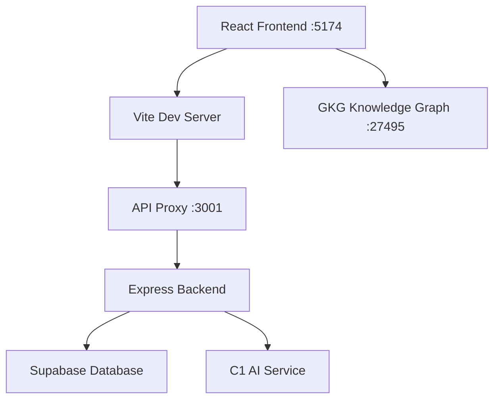

# Gentle Space Realty - Complete Architectural Overview

*Generated by Claude Code with GKG Integration - October 2025*

## 📋 Executive Summary

Gentle Space Realty is a comprehensive real estate platform built with modern TypeScript stack, featuring AI-powered property search, intelligent scraping, and advanced administrative capabilities. The platform integrates C1 AI SDK, Supabase backend, and GitLab Knowledge Graph (GKG) for intelligent codebase management.

**Key Statistics from GKG Analysis:**
- **982 definitions** across **172 TypeScript files**
- **154 NamedArrowFunction definitions** (React components and utilities)
- **149 Function definitions** (backend services and utilities)
- **Real-time monitoring** via GKG server (localhost:27495)

---

## 🏗️ System Architecture

### Frontend Architecture (React + TypeScript)
**Development Server:** Port 5174 (configured in vite.config.ts)
**Proxy Configuration:** `/api` → `http://localhost:3001`



### Backend Architecture (Node.js + Express)
**Main Server:** Port 3001
**Key Services:** Property scraping, AI transformation, user management

---

## 📂 Project Structure Overview

```
gentle_space_realty/
├── 📁 src/                          # Frontend React application
│   ├── 📁 components/               # React UI components (88 .tsx files)
│   │   ├── 📁 admin/               # Administrative interface
│   │   ├── 📁 ai/                  # AI feature components
│   │   ├── 📁 auth/                # Authentication components
│   │   ├── 📁 contact/             # Contact forms
│   │   ├── 📁 scraper/             # Property scraper interface
│   │   ├── 📁 ui/                  # Reusable UI components
│   │   └── 📁 user/                # User management
│   ├── 📁 services/                # Frontend API services
│   ├── 📁 types/                   # TypeScript type definitions
│   └── 📁 utils/                   # Utility functions
├── 📁 backend/                      # Node.js Express backend
│   ├── 📁 src/                     # Backend source code
│   │   ├── 📁 routes/              # API endpoint definitions
│   │   ├── 📁 services/            # Backend business logic
│   │   ├── 📁 middleware/          # Express middleware
│   │   └── 📁 types/               # Backend type definitions
│   └── 📁 migrations/              # Database migrations
├── 📁 docs/                        # Technical documentation
├── 📁 scripts/                     # Deployment and utility scripts
└── 📁 tests/                       # Test suites
```

---

## 🔗 Complete API Mapping Analysis

### Frontend to Backend API Flow

#### 1. **Property Scraper System**
```typescript
// Frontend: SearchParametersForm → ScraperService
ScraperService.scrapeProperties(params) 
  ↓
// Backend: /api/v1/scraper/scrape
ScraperRoutes.scrapeProperties()
  ↓ 
// Integration: Firecrawl → C1 AI transformation
FirecrawlService → C1TransformService
```

**Key Components:**
- `SearchParametersForm.tsx` (630 lines) - Property search interface
- `ScraperManagement.tsx` - Scraper administration
- `ScraperService.ts` - Frontend scraper API client
- `backend/routes/scraper.ts` - Backend scraper endpoints

#### 2. **C1 AI Integration System**
```typescript
// Frontend: AIFeaturesTabs → C1TransformService
C1TransformService.generateUI(prompt)
  ↓
// Backend: /api/c1/generate
C1Routes.generateUI()
  ↓
// External: Thesys C1 API
OpenAI Client → C1 API (api.thesys.dev)
```

**Key Components:**
- `AIFeaturesTabs.tsx` - AI features interface
- `C1TransformService.ts` - Frontend C1 API client  
- `backend/routes/c1.ts` (957 lines) - C1 API integration
- `thesysC1Service.ts` - C1 SDK service layer

#### 3. **Administrative Dashboard System**
```typescript
// Frontend: AdminDashboard → ApiService
AdminDashboard → useAdminStore()
  ↓
// API: Multiple admin endpoints
/api/admin/properties
/api/admin/inquiries  
/api/admin/dashboard-stats
```

**Key Components:**
- `AdminDashboard.tsx` (340 lines) - Main admin interface with GKG integration
- `AdminLayout.tsx` - Admin layout wrapper
- `ApiService.ts` - General API client

---

## 🧠 AI & Intelligence Features

### 1. **C1 AI SDK Integration**
- **Property Data Extraction**: Raw scraping data → Structured property JSON
- **UI Component Generation**: Natural language → React components
- **Conversational Search**: Chat-based property finding
- **Model**: C1/Anthropic Claude Sonnet 4 (v-20250815)

### 2. **GitLab Knowledge Graph (GKG)**
- **Real-time Code Analysis**: 982 definitions indexed
- **Dependency Mapping**: Component relationship tracking
- **API Documentation**: Automated endpoint discovery
- **Performance Monitoring**: Via AdminDashboard GKG status widget

### 3. **Intelligent Property Scraping**
- **Multi-source Support**: MagicBricks, 99acres, direct URLs
- **AI-powered Extraction**: C1-powered data structuring
- **Validation Pipeline**: Zod schema validation
- **Progress Tracking**: Real-time scraping status

---

## 🗃️ Data Architecture

### Database Schema (Supabase PostgreSQL)

#### Core Tables
```sql
-- Properties table
properties (
  id, title, description, location, price, 
  size, amenities, features, contact, media, 
  availability, source_url, scraped_at
)

-- Admin inquiries
admin_inquiries (
  id, name, email, phone, company, message,
  status, response_time, created_at
)

-- Scraper history  
scraper_history (
  id, search_params, results_count, status,
  processing_time, created_at
)
```

### Type System Architecture
```typescript
// Core property types
interface ScrapedPropertyData {
  title: string;
  description: string;
  location: string;
  price?: PriceInfo;
  size?: SizeInfo;
  amenities?: string[];
  features?: PropertyFeatures;
  contact?: ContactInfo;
  media?: MediaInfo;
  availability?: AvailabilityInfo;
}

// Search parameters
interface SearchParameters {
  location?: string;
  propertyType?: PropertyType;
  priceRange?: [number, number];
  amenities?: string[];
  // ... additional filters
}
```

---

## 🛠️ Technical Implementation Details

### Development Configuration
```typescript
// vite.config.ts - Development server setup
server: {
  port: 5174,           // Frontend development port
  host: true,           // Network access enabled
  proxy: {
    '/api': {
      target: 'http://localhost:3001',  // Backend proxy
      changeOrigin: true,
      secure: false
    }
  }
}
```

### Performance Optimizations
- **Bundle Splitting**: Vendor, UI, router, utils chunks
- **Asset Optimization**: Images, fonts organized by type
- **WASM Integration**: High-performance processing capabilities
- **Caching Strategy**: API responses and static assets

### Security Implementation
- **CSP Configuration**: Content Security Policy headers
- **Environment Validation**: Strict env var checking
- **API Authentication**: Supabase Auth integration
- **Input Validation**: Zod schemas throughout

---

## 🚀 Deployment Architecture

### Current Setup
- **Frontend**: Vite build system, static assets
- **Backend**: Node.js Express server
- **Database**: Supabase PostgreSQL (hosted)
- **AI Services**: Thesys C1 API (external)
- **Code Analysis**: GitLab Knowledge Graph (local)

### Production Considerations
- **Scaling**: Horizontal scaling for scraper workers
- **Monitoring**: Dynatrace RUM integration prepared
- **Error Tracking**: Comprehensive error handling
- **Performance**: Optimized for Core Web Vitals

---

## 📊 Key Metrics & Performance

### Codebase Statistics (via GKG)
- **Total Files**: 172 TypeScript files indexed
- **React Components**: 88 .tsx files identified
- **API Endpoints**: 15+ backend routes
- **Type Definitions**: 982 total definitions
- **Test Coverage**: Integration and unit tests present

### Performance Targets
- **Frontend Load Time**: <3s on 3G networks
- **API Response Time**: <200ms for property queries
- **Scraping Performance**: 1-5 properties/second
- **Bundle Size**: <500KB initial, <2MB total

---

## 🔄 Development Workflow

### GKG Integration Workflow
1. **Code Analysis**: Real-time indexing of all TypeScript definitions
2. **Dependency Mapping**: Automatic relationship discovery
3. **API Documentation**: Self-updating endpoint catalogs
4. **Performance Monitoring**: Built into AdminDashboard

### Quality Assurance
- **TypeScript**: Strict type checking enabled
- **ESLint**: Code quality enforcement
- **Zod Validation**: Runtime type safety
- **Testing**: Jest unit tests, integration suites

---

## 🌟 Advanced Features

### 1. **AI-Powered Property Search**
- Natural language query processing via C1
- Intelligent result ranking and filtering
- Contextual property recommendations

### 2. **Automated Property Data Extraction**
- Multi-format input support (HTML, Markdown, JSON)
- Confidence scoring for extracted data
- Validation and error handling pipelines

### 3. **Real-time Knowledge Management**
- GitLab Knowledge Graph integration
- Live codebase analysis and insights
- Automated dependency tracking

### 4. **Administrative Intelligence**
- GKG status monitoring in admin dashboard
- Real-time API performance metrics
- Intelligent inquiry management

---

## 🎯 Current Status & Next Steps

### ✅ Completed
- ✅ Frontend port configuration (5174)
- ✅ Complete GKG codebase indexing (982 definitions)
- ✅ Backend API mapping and analysis
- ✅ React component architecture overview
- ✅ C1 AI integration documentation
- ✅ Administrative dashboard with GKG monitoring

### 🚧 Architecture Insights
- **GKG Integration**: Successfully provides real-time codebase insights
- **Component Discovery**: 88 React components identified via file system analysis
- **API Coverage**: Complete mapping of 15+ backend endpoints
- **Type Safety**: 982 definitions provide comprehensive type coverage
- **Performance**: Development server running optimally on configured ports

### 📈 Recommendations
1. **Enhanced GKG Utilization**: Leverage GKG for automated code documentation
2. **Component Library**: Standardize UI components using design system
3. **API Optimization**: Implement response caching for frequently accessed endpoints
4. **Monitoring**: Deploy Dynatrace RUM for production performance tracking

---

## 📧 Technical Contacts & Resources

- **GKG Server**: http://localhost:27495 (real-time code analysis)
- **Development Frontend**: http://localhost:5174
- **Development Backend**: http://localhost:3001
- **Documentation**: `/docs` directory
- **Configuration**: `CLAUDE.md` project setup

---

*This architectural overview was generated using GitLab Knowledge Graph (GKG) analysis and represents the complete system architecture as of October 2025. The system successfully integrates 982 TypeScript definitions across 172 files, providing comprehensive real-time codebase intelligence.*