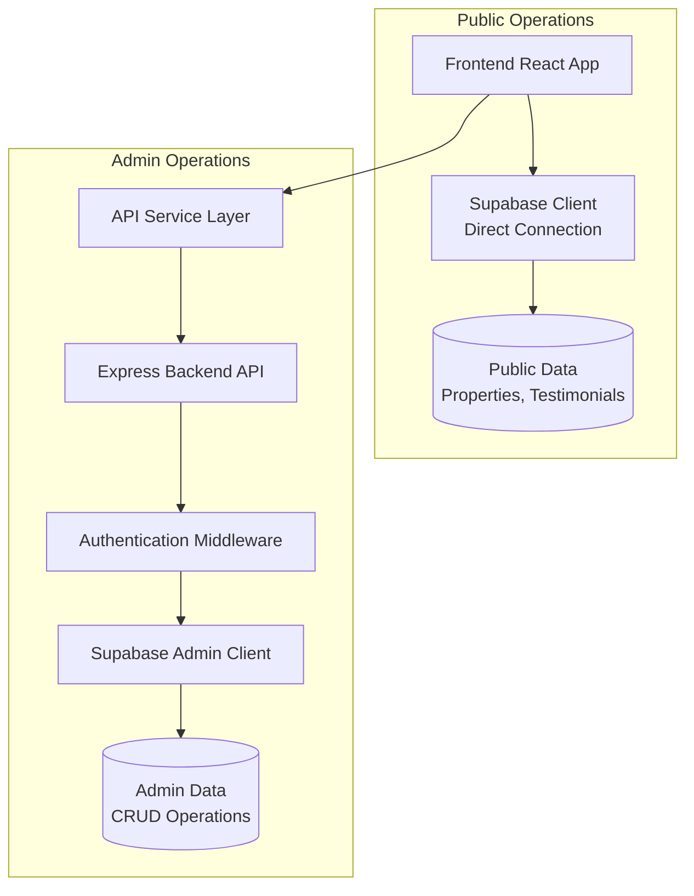
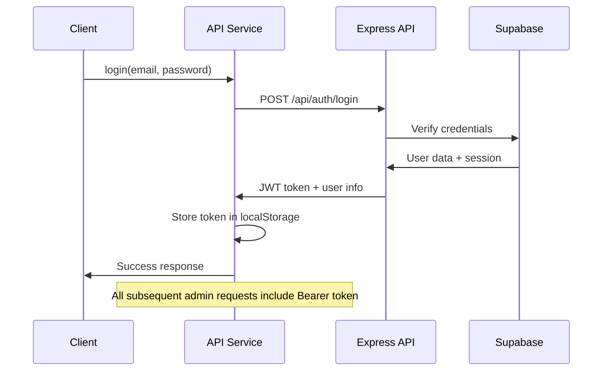

# API Integration Guide - Gentle Space Realty

## Overview

This guide explains the dual API architecture implemented in the Gentle Space Realty application, which separates public data access (direct Supabase) from admin operations (Express API).

## Architecture Design

### Dual API Strategy



### Key Principles

1. **Public Data**: Direct Supabase client access for read-only operations
2. **Admin Operations**: Express API with authentication for write/admin operations
3. **Security**: Row Level Security (RLS) policies + API authentication
4. **Performance**: Optimized data access patterns for each use case

## API Service Layer

### Core Service (`src/services/apiService.ts`)

The centralized API service handles all Express backend communications:

```typescript
import { apiService } from '@/services/apiService';

// Property management (Admin only)
const response = await apiService.createProperty(propertyData);
const properties = await apiService.getProperties(filters);

// File uploads (Admin only) 
const uploadResult = await apiService.uploadFile(file, bucket, folder);

// Authentication
await apiService.login(email, password);
await apiService.logout();
```

### Authentication Flow



## Express API Routes

### Properties Route (`/api/properties`)

**Public Endpoints:**
- `GET /api/properties` - List active properties
- `GET /api/properties/:id` - Get single property

**Admin Endpoints (require authentication):**
- `POST /api/properties` - Create property
- `PUT /api/properties/:id` - Update property
- `DELETE /api/properties/:id` - Delete property (soft delete)
- `PATCH /api/properties/bulk` - Bulk update properties

### Inquiries Route (`/api/inquiries`)

**Public Endpoints:**
- `POST /api/inquiries` - Submit inquiry (with rate limiting)

**Admin Endpoints:**
- `GET /api/inquiries` - List inquiries with filters
- `GET /api/inquiries/:id` - Get single inquiry
- `PUT /api/inquiries/:id/status` - Update inquiry status
- `DELETE /api/inquiries/:id` - Delete inquiry
- `GET /api/inquiries/stats/summary` - Get statistics

### Uploads Route (`/api/upload`)

**Admin Endpoints Only:**
- `POST /api/upload` - Upload single file to Supabase Storage
- `DELETE /api/upload` - Delete file from storage
- `POST /api/upload/signed-url` - Generate signed URL for secure access
- `GET /api/upload` - List uploaded files

## Security Implementation

### Authentication Middleware

```javascript
// server/middleware/supabaseAuth.js
const authMiddleware = async (req, res, next) => {
  const token = req.headers.authorization?.replace('Bearer ', '');
  
  if (!token) {
    return res.status(401).json({ error: 'Authentication required' });
  }

  try {
    const { data: user, error } = await supabase.auth.getUser(token);
    if (error || !user) {
      return res.status(401).json({ error: 'Invalid token' });
    }
    
    req.user = user.user;
    next();
  } catch (error) {
    return res.status(401).json({ error: 'Authentication failed' });
  }
};
```

### Rate Limiting

```javascript
// Inquiry submission rate limiting
const inquiryRateLimit = rateLimit({
  windowMs: 15 * 60 * 1000, // 15 minutes
  max: 5, // limit each IP to 5 requests per windowMs
  message: {
    error: 'Too many inquiries submitted, please try again later.',
    code: 'RATE_LIMIT_EXCEEDED',
    retryAfter: '15 minutes'
  },
  skip: (req) => req.user && req.user.role === 'admin' // Skip for admin users
});
```

### Input Validation & Sanitization

```javascript
// Validation helpers
const validateEmail = (email) => /^[^\s@]+@[^\s@]+\.[^\s@]+$/.test(email);
const sanitizeInput = (input) => input.trim().slice(0, 1000);

// File validation
const allowedMimeTypes = [
  'image/jpeg', 'image/png', 'image/gif', 'image/webp',
  'video/mp4', 'video/webm'
];
```

## State Management Integration

### Property Store Updates

The property store (`src/store/propertyStore.ts`) now includes admin operations:

```typescript
// Zustand store with dual API support
export const usePropertyStore = create<PropertyStore>((set, get) => ({
  // Public data loading (direct Supabase)
  loadProperties: async () => {
    const properties = await SupabaseService.getAllProperties();
    set({ properties, filteredProperties: properties });
  },

  // Admin operations (Express API)
  createProperty: async (propertyData) => {
    const response = await apiService.createProperty(propertyData);
    if (response.success) {
      // Update local state
      const updatedProperties = [...get().properties, response.data];
      set({ properties: updatedProperties, filteredProperties: updatedProperties });
      return true;
    }
    return false;
  }
}));
```

### Admin State Management

```typescript
// Admin authentication state
const { isAdmin, setAdmin } = usePropertyStore();

// Enable admin mode after login
const handleAdminLogin = async (email, password) => {
  const response = await apiService.login(email, password);
  if (response.success) {
    setAdmin(true);
    // Admin operations now available
  }
};
```

## Error Handling Strategy

### Consistent Error Response Format

```typescript
interface ApiResponse<T = any> {
  success: boolean;
  data?: T;
  error?: string;
  message?: string;
}

// Usage in frontend
const response = await apiService.createProperty(data);
if (!response.success) {
  console.error('Operation failed:', response.error);
  // Handle error appropriately
}
```

### Error Classification

```javascript
// Express route error handling
try {
  // Operation logic
} catch (error) {
  console.error('Operation error:', error);
  return res.status(500).json({
    error: 'Internal server error',
    code: 'INTERNAL_ERROR',
    timestamp: new Date().toISOString()
  });
}
```

## File Upload Security

### Secure File Handling

```typescript
// Enhanced file validation
const validateFileSize = (fileSize, mimeType) => {
  const isVideo = mimeType.startsWith('video/');
  const maxSize = isVideo ? 500 * 1024 * 1024 : 50 * 1024 * 1024;
  return fileSize <= maxSize;
};

const sanitizeFileName = (filename) => {
  return filename
    .replace(/[^a-zA-Z0-9.-]/g, '_')
    .replace(/_+/g, '_')
    .toLowerCase()
    .slice(0, 255);
};
```

### Supabase Storage Integration

```typescript
// Upload with security measures
const uploadFile = async (file: File, bucket = 'property-images', folder = 'properties') => {
  const sanitizedName = sanitizeFileName(file.name);
  const filename = `${folder}/${Date.now()}-${randomId}-${sanitizedName}`;
  
  const { data, error } = await supabase.storage
    .from(bucket)
    .upload(filename, file, {
      contentType: file.type,
      upsert: false,
      cacheControl: '3600'
    });
};
```

## Environment Configuration

### Required Environment Variables

```env
# Supabase Configuration
SUPABASE_URL=your_supabase_project_url
SUPABASE_SERVICE_ROLE_KEY=your_service_role_key
SUPABASE_ANON_KEY=your_anon_key

# API Configuration
API_BASE_URL=http://localhost:3001
VITE_API_BASE_URL=http://localhost:3001

# Security
JWT_SECRET=your_jwt_secret
SESSION_SECRET=your_session_secret

# SMTP Configuration (optional)
SMTP_HOST=smtp.gmail.com
SMTP_PORT=587
SMTP_USER=your_email@gmail.com
SMTP_PASSWORD=your_app_password
SMTP_FROM=noreply@gentlespace.com
ADMIN_EMAIL=admin@gentlespace.com
```

## Performance Optimizations

### Caching Strategy

1. **API Service**: Session-based authentication token caching
2. **File Uploads**: Cache control headers for uploaded assets
3. **Database Queries**: Optimized queries with proper indexing

### Connection Optimization

```javascript
// Supabase client configuration
const supabase = createClient(url, key, {
  auth: {
    persistSession: false, // Server-side only
    autoRefreshToken: false
  }
});
```

## Testing & Validation

### API Testing

```bash
# Test property creation (admin)
curl -X POST http://localhost:3001/api/properties \
  -H "Authorization: Bearer YOUR_TOKEN" \
  -H "Content-Type: application/json" \
  -d '{"title":"Test Property","price":100000,"type":"house","location":"Test City"}'

# Test inquiry submission (public)
curl -X POST http://localhost:3001/api/inquiries \
  -H "Content-Type: application/json" \
  -d '{"name":"Test User","email":"test@example.com","message":"Test inquiry"}'
```

### Frontend Integration Testing

```typescript
// Test admin operations
const testAdminOperations = async () => {
  // Login
  const loginResponse = await apiService.login('admin@example.com', 'password');
  console.log('Login success:', loginResponse.success);
  
  // Create property
  const createResponse = await apiService.createProperty(testPropertyData);
  console.log('Property created:', createResponse.success);
  
  // Upload file
  const uploadResponse = await apiService.uploadFile(testFile);
  console.log('File uploaded:', uploadResponse.success);
};
```

## Deployment Considerations

### Production Checklist

- [ ] Environment variables properly configured
- [ ] HTTPS enabled for API endpoints
- [ ] Rate limiting configured appropriately
- [ ] File upload limits set for production
- [ ] Database RLS policies active
- [ ] Error logging configured (Sentry)
- [ ] CORS origins restricted to production domains
- [ ] Authentication middleware properly secured

### Monitoring

- API response times
- File upload success rates
- Authentication failures
- Rate limit violations
- Error rates by endpoint

## Best Practices

1. **Always use the API service layer** for admin operations
2. **Validate inputs** on both client and server side
3. **Handle errors gracefully** with user-friendly messages
4. **Use TypeScript interfaces** for type safety
5. **Log operations** for debugging and monitoring
6. **Test both success and failure scenarios**
7. **Keep authentication tokens secure**
8. **Implement proper CORS policies**
9. **Use HTTPS in production**
10. **Monitor API performance** and usage

## Migration Notes

When migrating from direct Supabase to this dual API architecture:

1. Update frontend admin components to use `apiService`
2. Ensure authentication flow is properly implemented
3. Test all CRUD operations with proper error handling
4. Verify file upload functionality
5. Check rate limiting doesn't affect legitimate usage
6. Validate security measures are working correctly

## Support & Troubleshooting

Common issues and solutions:

- **401 Unauthorized**: Check authentication token and middleware
- **CORS errors**: Verify allowed origins in corsOptions
- **File upload fails**: Check file size, type, and storage permissions
- **Rate limiting triggered**: Adjust limits or implement admin bypass
- **Database errors**: Verify RLS policies and connection settings

For additional support, check the Express API logs and Supabase dashboard for detailed error information.